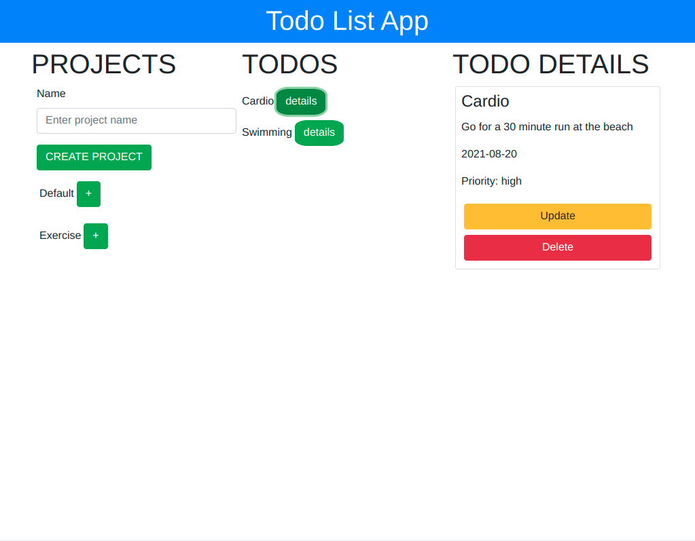
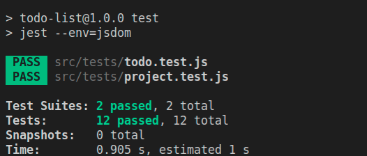

# todo-list


> A JS todo-list CRUD application. Set up with webpack for modern JS capabilities using DOM manipulationA website built using purely DOM manipulation and event handling to create a todo list app and bundle it up using Webpack for a Modern JavaScript touch. This application uses JavaScript Object Oriented Programming to group todos within each project object and stores and retrieves a list of these projects using LocalStorage.

### Screenshot



## Built With

- HTML5 & CSS3, & JavaScript
- Bootstrap

## Instructions
To get a local copy up and running follow these simple example steps.

### Prerequisites
- Gitbash installed to navigate between the branches.
- A preferred text editor for example VS Code.
- A browser such as Google Chrome

### Install
Clone this [GitHub Repo](https://github.com/KabohaJeanMark/todo-list/) to your computer on yourFolder by typing these commands in the terminal or download as a Zip file and extract.
```
$ mkdir yourFolder
$ cd yourFolder
$ git clone https://github.com/KabohaJeanMark/todo-list/

```

### Using webpack
- Install the packages locally and run the command to modify your bundled js based on changes in the JavaScript file.
```
npm install
npm run dev
```
- Run the following command so that webpack to always watch your changes and updates your modified js whenever changes are made to the index.js or it's module files it is importing from
```
npm run watch
```

### Testing using jest
- To check out the tests, run the following command
```
npm run test
```


### Usage
- View with live Server in VS code or Right click and open the index.html in your browser to view.
- Create a project using the form in the first third of the page below the heading PROJECTS.
- Your created project will appear below the already existing default project.
- Click the + button to create a todo under the project you want it to fall under. Or click the + on default to save under default project.
- A form will appear with fields title, description, dueDate and priority to be selected in the second column(TODOS).
- Below the form other todos belonging to that project will display.
- Upon successful creation, the form disappears and the user views their created todo and others under it's project.
- Each of these todos has a details button.
- When you click the details button, a card appears in the right column (TODO DETAILS) with details for that particular todo and buttons to either update with a form or delete it.
- Upon refreshing, the page reloads and shows all projects in the 1st column(PROJECTS).

## Author

👤 **Kaboha Jean Mark**

- GitHub: [@KabohaJeanMark](https://github.com/KabohaJeanMark)
- Twitter: [@jean_quintus](https://twitter.com/jean_quintus)
- LinkedIn: [Jean Mark Kaboha](https://www.linkedin.com/in/jean-mark-kaboha-software-engineer/)


## 🤝 Contributing

Contributions, issues, and feature requests are welcome!

Feel free to check the [issues page](https://github.com/KabohaJeanMark/todo-list/issues).

## Show your support

Give a ⭐️ if you like this project!

## Acknowledgments

- Hat tip to Microverse for the README template, instructions and tutoring for this Capstone project.

## 📝 License

This project is [MIT](./LICENSE) licensed.